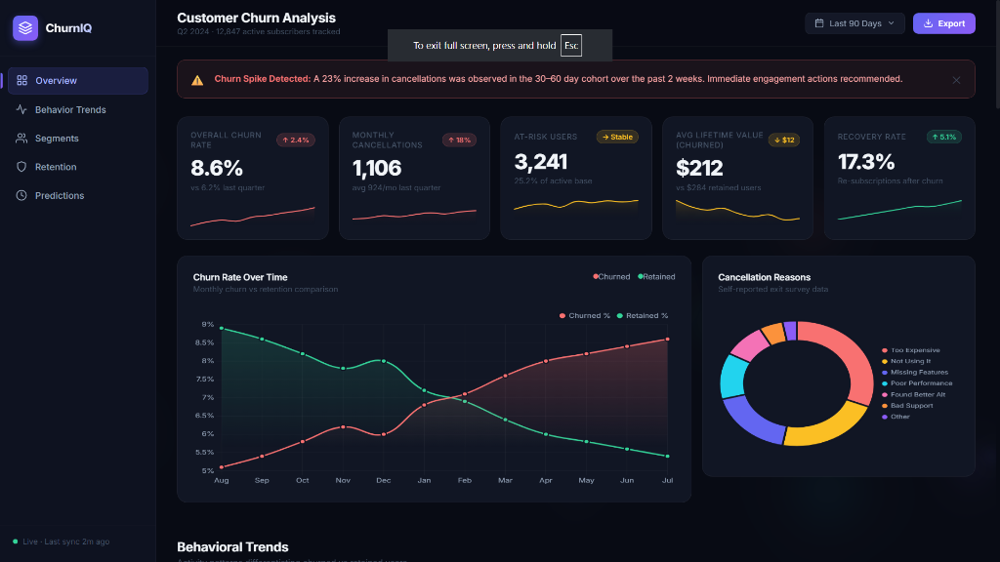
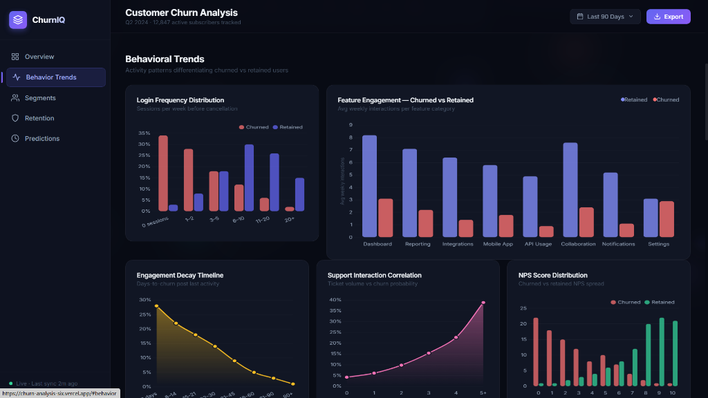
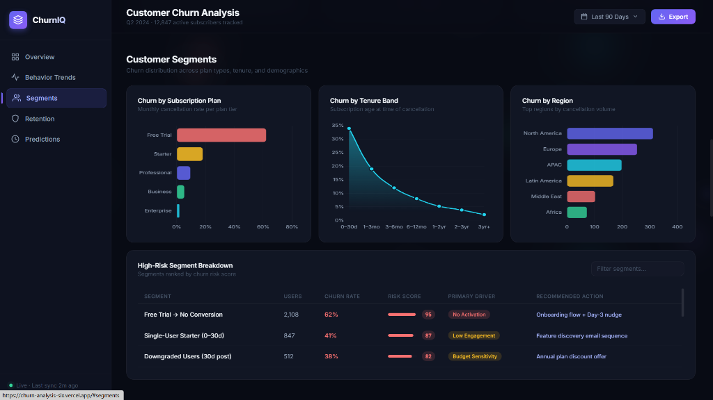
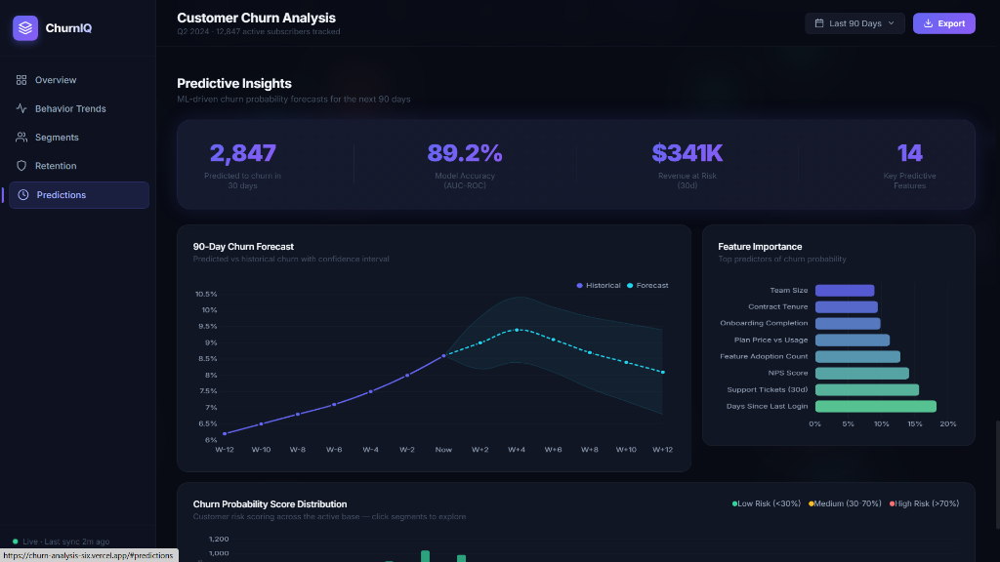
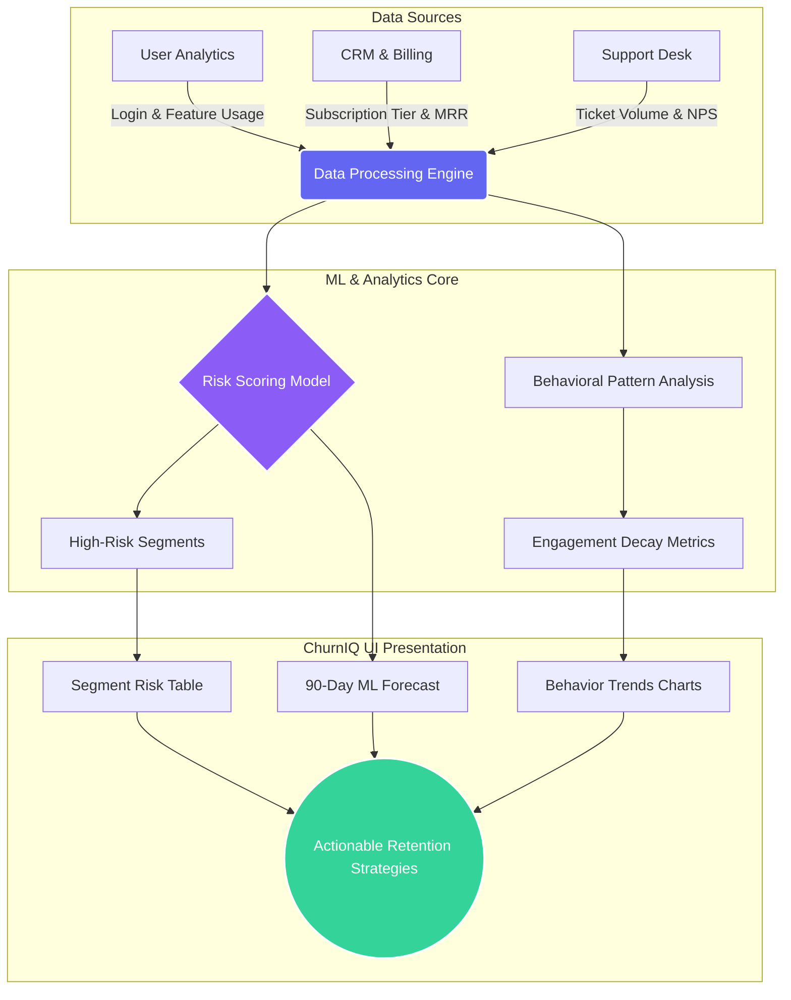

<div align="center">

<!-- Animated Header Banner -->


<!-- Animated Typing Text -->
<a href="https://churn-analysis-six.vercel.app/">
  
</a>

**A breathtaking, fully interactive dashboard to identify subscription cancellation patterns, evaluate user engagement, and determine key factors that lead to churn.**

[](https://churn-analysis-six.vercel.app/)
[](https://github.com/prateekvijay265/Churn-Analysis)

</div>

---

## 🌟 Overview

**ChurnIQ** transforms raw customer data into a visual narrative. By mapping out engagement decay, analyzing cancellation reasons, and predicting future churn probability, this dashboard provides product and success teams with the exact metrics they need to deploy targeted retention strategies.

### 📸 Dashboard Sneak Peek

<div align="center">
  
  <br/>
  
  <br/>
  
  <br/>
  
</div>

---

## ⚙️ How It Works & Data Flow

ChurnIQ simulates a data pipeline that ingests, scores, and visualizes customer risk. Here is how the conceptual architecture flows from raw data to actionable business intelligence:



---

## 🚀 Key Features

### 1️⃣ Executive Overview
*   **Real-time KPIs**: Overall churn rate, monthly cancellations, at-risk users, and recovery rates displayed with micro-sparklines.
*   **Temporal Tracking**: 12-month churn vs. retention timeline comparison.

### 2️⃣ Behavioral Trends
*   **Engagement Funnels**: Days-to-churn decay timelines post-last-activity.
*   **Feature Heatmaps**: Radar-style distribution of feature usage separating retained users from churned users.
*   **Support Correlation**: Mapping support ticket volume against churn likelihood.

### 3️⃣ High-Risk Customer Segments
*   **Granular Filters**: Interactive risk table breaking down cohorts by primary driver (e.g., Budget Sensitivity, Feature Parity Gap).
*   **Action Recommendations**: Automated strategy suggestions per risk segment.

### 4️⃣ ML Predictive Forecasts
*   **90-Day Projections**: Forward-looking churn line with upper/lower confidence bounds.
*   **Feature Importance Ranking**: See exactly *what* factors (e.g., Days since last login, NPS score) are weighting the ML risk model.

---

## 🛠️ Technology Stack

Built with a lightning-fast, zero-build-step frontend stack for absolute maximum performance and portability:

<div align="center">
  
  
  
  
  
</div>

---

## 💻 Local Setup & Development

Want to run it locally? It takes less than 5 seconds.

1. **Clone the repository:**
   ```bash
   git clone https://github.com/prateekvijay265/Churn-Analysis.git
   ```
2. **Navigate to the directory:**
   ```bash
   cd Churn-Analysis
   ```
3. **Run it:**
   Simply double click the `index.html` file to open it in your browser, or use a live server extension in VSCode for hot-reloading.

---

<div align="center">
  
</div>
